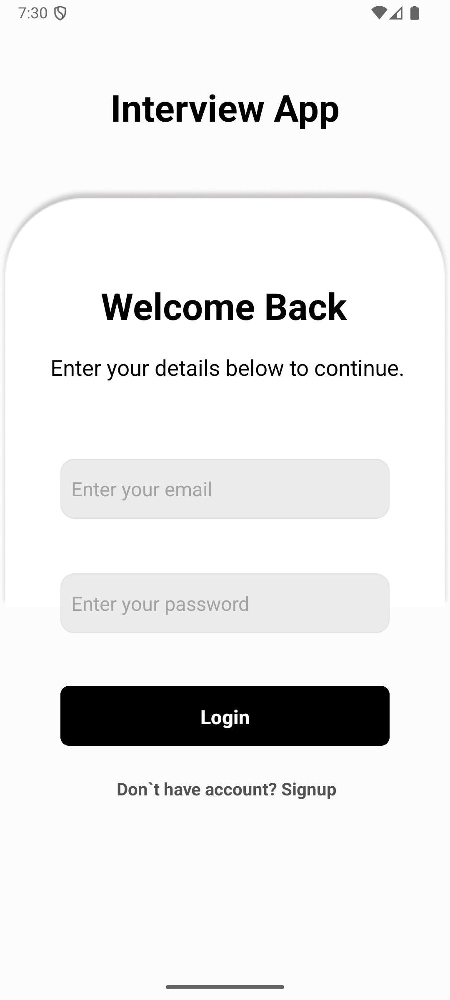
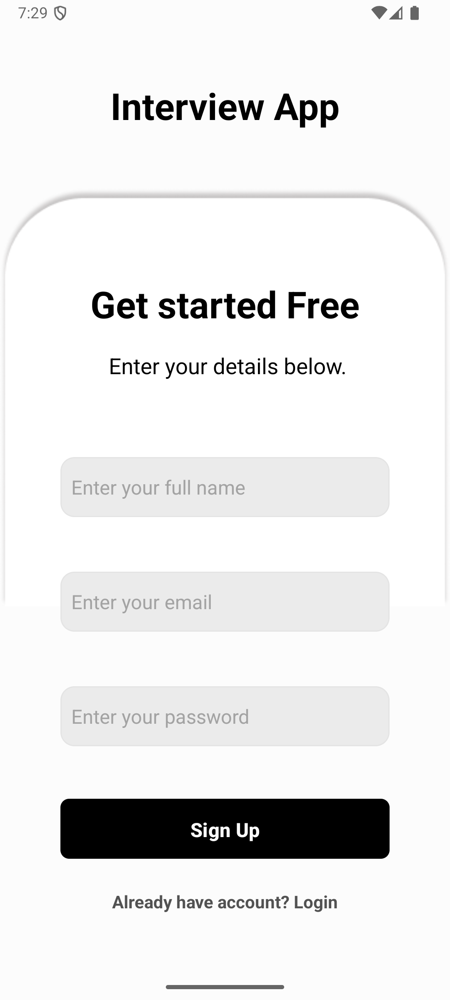
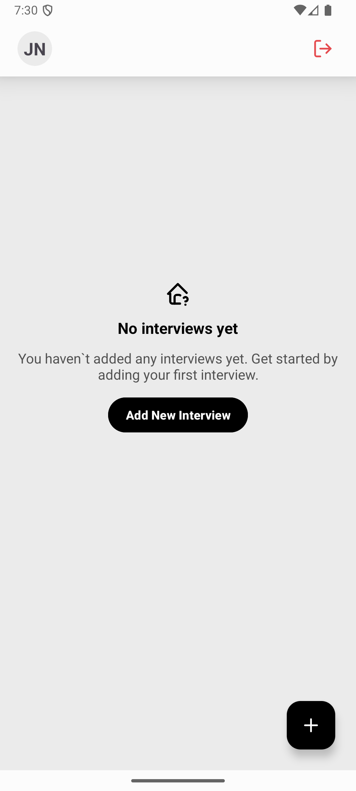
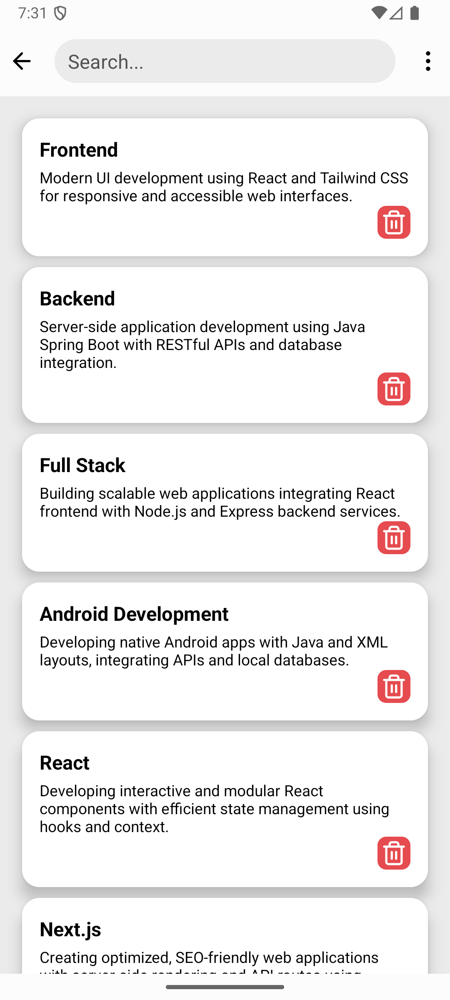
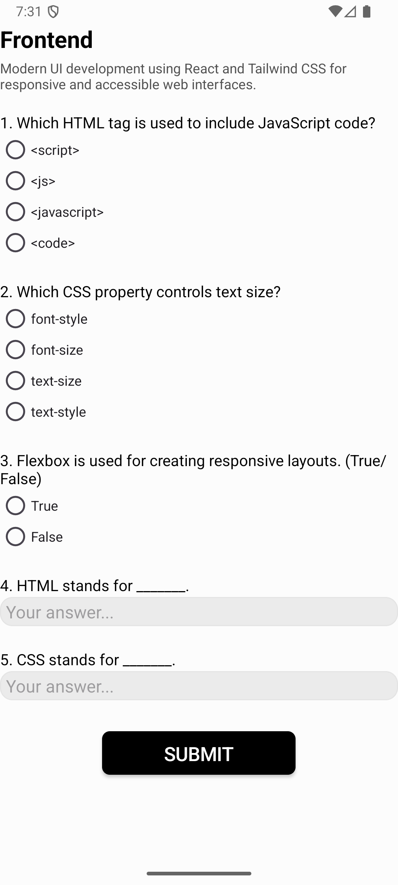
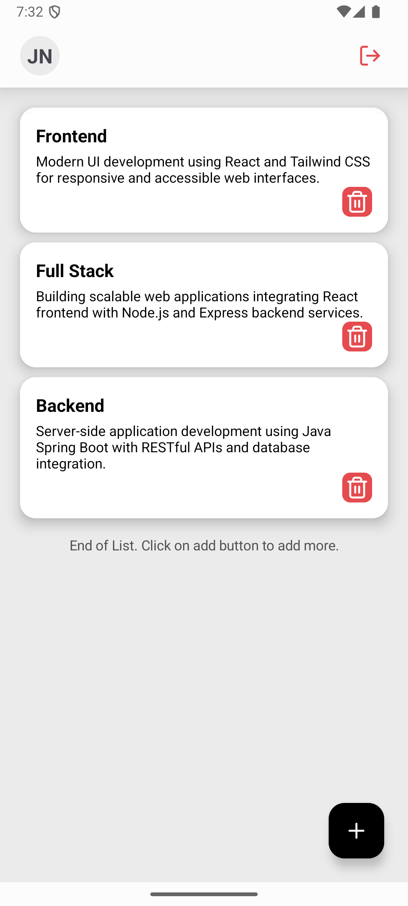
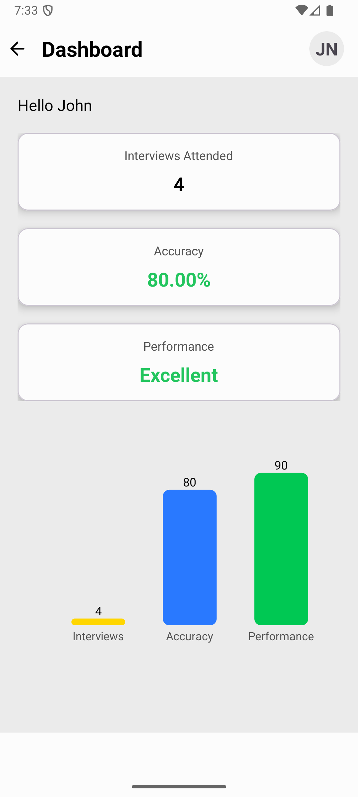

# Interview App (Android)

An offline Android application to manage interview practice sessions, track performance, and analyze progress using simple analytics.

Built as a **Mini Project** for the course **Mobile Application Development (CSE2506)**.

---

## Features

- User Signup & Login (SharedPreferences)
- Create and manage interview sessions
- Attend interviews with MCQ-based questions
- Automatic performance & accuracy calculation
- Dashboard with statistics and bar chart visualization
- Fully offline (SQLite database)
- Logout with session clearing

---

## Tech Stack

- **Language:** Java
- **UI:** XML
- **Database:** SQLite
- **Auth:** SharedPreferences
- **Tools:** Android Studio
- **Min SDK:** API 21 (Android 5.0)

---

## App Screens

### Login & Signup

### Home & Add Interview

### Attend Interview

### Dashboard

>  Place all screenshots inside a `screenshots/` folder in the root directory.

---

## Modules Overview

- **Authentication:** Local login/signup using SharedPreferences
- **Home:** View, attend, or delete interviews
- **Add Interview:** Create and store interviews in SQLite
- **Attend Interview:** Answer questions and calculate score
- **Dashboard:** View total interviews, accuracy, performance (bar graph)
- **Logout:** Clears session data

---

## How to Run

1. Clone the repository
2. Open in **Android Studio**
3. Let Gradle sync
4. Run on emulator or physical Android device (Android 8.0+ recommended)

---

## Project Team

- Mohan A
- Manoj Kumar B M
- Dilip D
- Deepak G
- **Kishore S V**

---

## Notes (Brutally Honest)

- This is a **local-only app** (no backend, no cloud sync).
- SharedPreferences auth is fine for a college project — **not production-safe**.
- SQLite + offline focus is a good design choice given scope.
- If you want this to look industry-grade later: add Firebase/Auth + Room + MVVM.

---

## License

Academic use only.